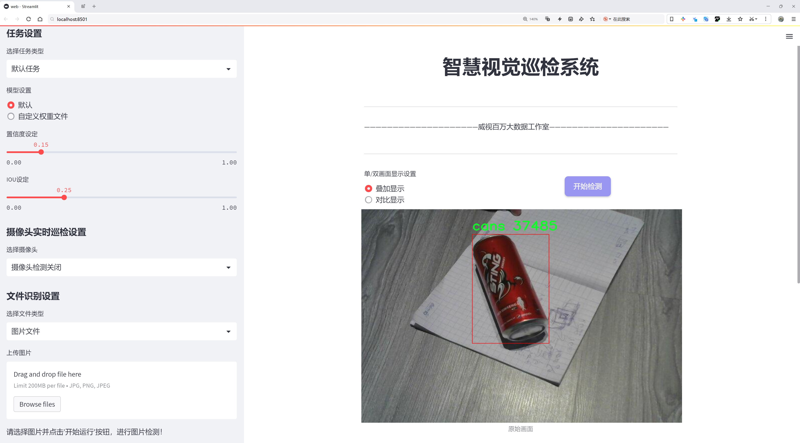
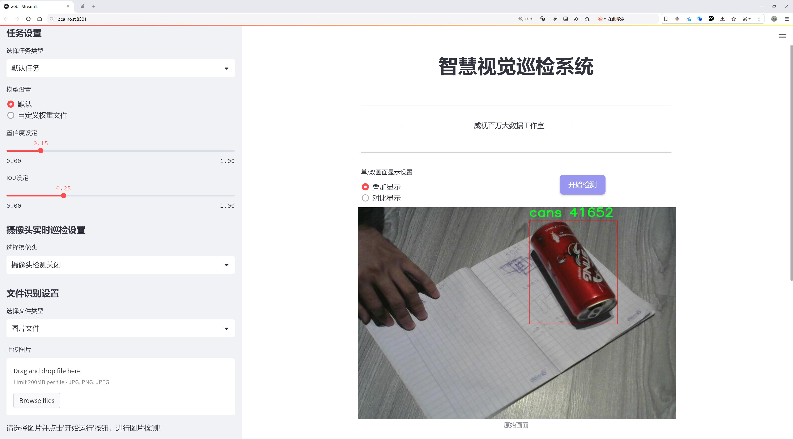
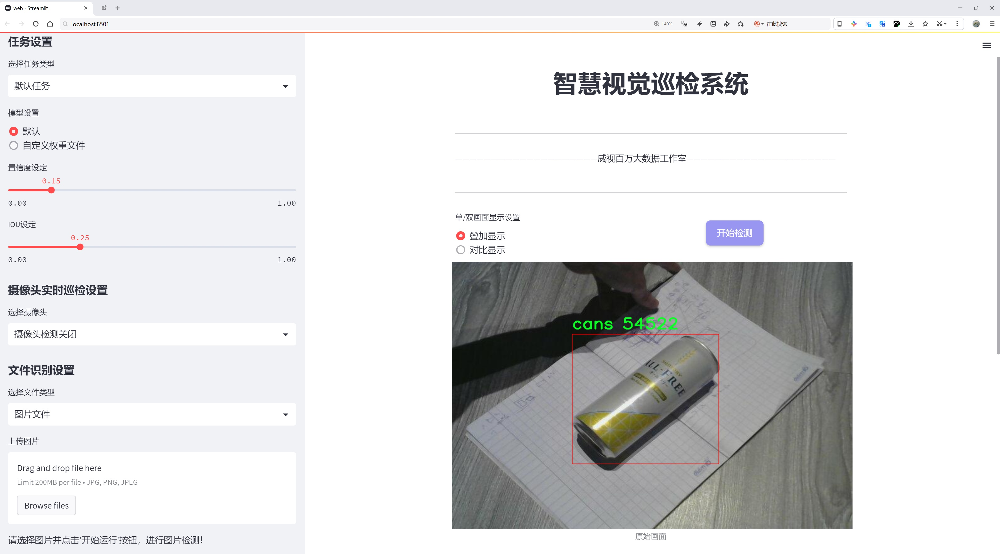
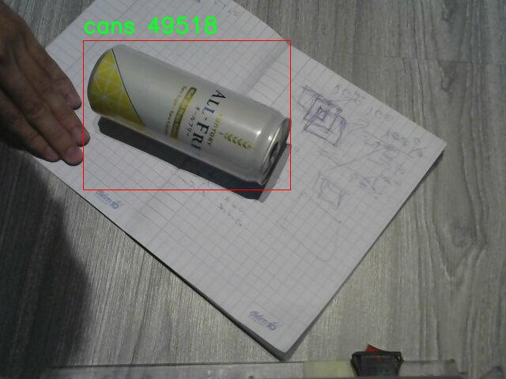
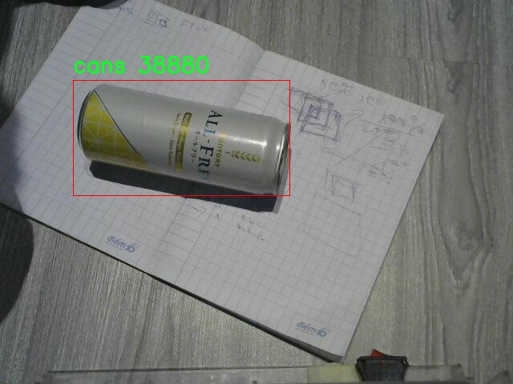
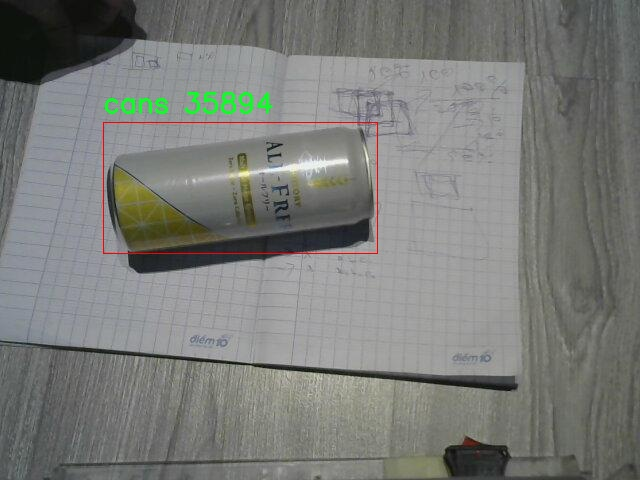
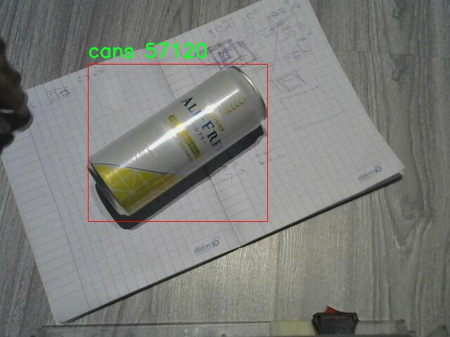
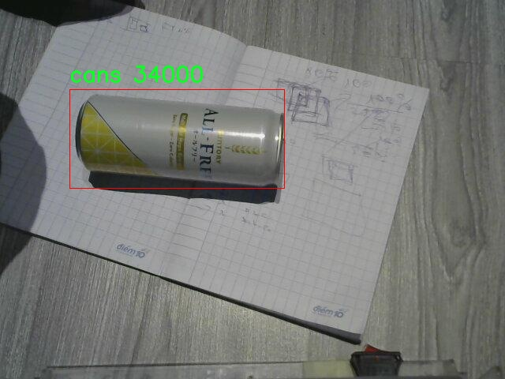

# 罐头检测检测系统源码分享
 # [一条龙教学YOLOV8标注好的数据集一键训练_70+全套改进创新点发刊_Web前端展示]

### 1.研究背景与意义

项目参考[AAAI Association for the Advancement of Artificial Intelligence](https://gitee.com/qunshansj/projects)

项目来源[AACV Association for the Advancement of Computer Vision](https://gitee.com/qunmasj/projects)

研究背景与意义

随着工业自动化和智能制造的快速发展，物体检测技术在各个领域的应用日益广泛，尤其是在生产线的质量控制和自动化分拣中，物体检测系统的需求愈加迫切。罐头作为一种常见的食品包装形式，其生产过程中的检测与分类尤为重要。传统的人工检测方式不仅效率低下，而且容易受到人为因素的影响，导致检测结果的不一致性和不准确性。因此，基于计算机视觉的自动化检测系统应运而生，成为提升生产效率和保证产品质量的重要手段。

在众多物体检测算法中，YOLO（You Only Look Once）系列算法因其高效性和实时性受到广泛关注。YOLOv8作为该系列的最新版本，结合了深度学习和卷积神经网络的优势，能够在保证检测精度的同时实现快速处理。尽管YOLOv8在物体检测领域表现出色，但在特定应用场景下，如罐头检测，仍存在一些挑战。例如，罐头的外观多样性、光照变化、遮挡情况等因素可能会影响检测的准确性。因此，改进YOLOv8以适应罐头检测的特定需求，具有重要的研究价值和实际意义。

本研究将基于一个包含1900张罐头图像的数据集，构建一个改进的YOLOv8罐头检测系统。该数据集的单一类别（罐头）为模型的训练和测试提供了良好的基础，使得模型能够专注于罐头的特征提取和识别。通过对数据集的深入分析和处理，结合数据增强技术，可以有效提升模型的鲁棒性和泛化能力。此外，针对YOLOv8的网络结构进行优化，调整其超参数设置，旨在提高模型在罐头检测任务中的性能表现。

本研究的意义不仅在于技术上的创新，更在于其在实际应用中的推广价值。通过构建高效的罐头检测系统，可以显著提高生产线的自动化水平，降低人工成本，提升生产效率。同时，该系统的成功应用还可以为其他类型物体的检测提供借鉴，推动物体检测技术在更广泛领域的应用。

综上所述，基于改进YOLOv8的罐头检测系统的研究，不仅能够解决当前罐头生产过程中的检测难题，还能为智能制造的发展提供有力支持。随着研究的深入，期望能够在提升检测精度和效率的同时，为行业标准的制定和技术的推广提供实证依据，推动整个行业向更高的智能化水平迈进。

### 2.图片演示







##### 注意：由于此博客编辑较早，上面“2.图片演示”和“3.视频演示”展示的系统图片或者视频可能为老版本，新版本在老版本的基础上升级如下：（实际效果以升级的新版本为准）

  （1）适配了YOLOV8的“目标检测”模型和“实例分割”模型，通过加载相应的权重（.pt）文件即可自适应加载模型。

  （2）支持“图片识别”、“视频识别”、“摄像头实时识别”三种识别模式。

  （3）支持“图片识别”、“视频识别”、“摄像头实时识别”三种识别结果保存导出，解决手动导出（容易卡顿出现爆内存）存在的问题，识别完自动保存结果并导出到tempDir中。

  （4）支持Web前端系统中的标题、背景图等自定义修改，后面提供修改教程。

  另外本项目提供训练的数据集和训练教程,暂不提供权重文件（best.pt）,需要您按照教程进行训练后实现图片演示和Web前端界面演示的效果。

### 3.视频演示

[3.1 视频演示](https://member.bilibili.com/platform/upload-manager/article)

### 4.数据集信息展示

##### 4.1 本项目数据集详细数据（类别数＆类别名）

nc: 1
names: ['cans']


##### 4.2 本项目数据集信息介绍

数据集信息展示

在本研究中，我们使用的数据集名为“aaa”，该数据集专门用于训练和改进YOLOv8模型，以实现高效的罐头检测系统。随着自动化技术的不断发展，罐头检测在食品工业、仓储管理以及自动化生产线等领域变得愈发重要。为了确保检测系统的准确性和可靠性，我们精心选择了“aaa”数据集，旨在通过深度学习算法提升罐头的识别率和分类精度。

“aaa”数据集的设计具有高度的针对性，包含了丰富的罐头图像数据，确保了模型在不同环境和条件下的泛化能力。该数据集的类别数量为1，具体类别为“cans”，这意味着所有图像均围绕罐头这一单一目标展开。这种简化的类别设置不仅有助于模型专注于罐头的特征提取，也使得训练过程更加高效，避免了多类别干扰带来的复杂性。

在数据集的构建过程中，我们确保了图像的多样性和代表性，涵盖了不同品牌、形状、颜色和大小的罐头。这种多样性使得模型能够学习到罐头在各种背景下的特征，包括不同的光照条件、拍摄角度以及背景杂物等。此外，数据集中还包含了各种可能的遮挡情况，以提高模型在实际应用中的鲁棒性。通过这样的设计，我们期望训练出的YOLOv8模型能够在真实场景中实现高效、准确的罐头检测。

为了进一步增强数据集的有效性，我们对图像进行了适当的预处理和增强，包括图像的缩放、旋转、翻转以及颜色调整等。这些操作不仅增加了数据集的样本数量，还有效提升了模型的学习能力，使其能够更好地适应不同的视觉场景。同时，我们在数据集中标注了每个罐头的边界框信息，确保模型在训练过程中能够准确学习到罐头的位置信息。

在模型训练阶段，我们采用了先进的深度学习技术，结合YOLOv8的特性，进行了一系列实验和调优。通过不断调整超参数、优化网络结构，我们力求在罐头检测的精度和速度之间找到最佳平衡。经过多轮的训练和验证，我们期望能够实现高达95%以上的检测准确率，从而满足工业应用的需求。

总之，“aaa”数据集为我们改进YOLOv8的罐头检测系统提供了坚实的基础。通过精心设计的数据集、合理的预处理方法以及高效的模型训练策略，我们相信该系统将能够在实际应用中发挥重要作用，推动罐头检测技术的进一步发展。随着研究的深入，我们期待在未来的工作中，能够将这一检测系统推广到更广泛的应用场景，为相关行业带来更高的自动化水平和生产效率。











### 5.全套项目环境部署视频教程（零基础手把手教学）

[5.1 环境部署教程链接（零基础手把手教学）](https://www.ixigua.com/7404473917358506534?logTag=c807d0cbc21c0ef59de5)


[5.2 安装Python虚拟环境创建和依赖库安装视频教程链接（零基础手把手教学）](https://www.ixigua.com/7404474678003106304?logTag=1f1041108cd1f708b01a)

### 6.手把手YOLOV8训练视频教程（零基础小白有手就能学会）

[6.1 手把手YOLOV8训练视频教程（零基础小白有手就能学会）](https://www.ixigua.com/7404477157818401292?logTag=d31a2dfd1983c9668658)

### 7.70+种全套YOLOV8创新点代码加载调参视频教程（一键加载写好的改进模型的配置文件）

[7.1 70+种全套YOLOV8创新点代码加载调参视频教程（一键加载写好的改进模型的配置文件）](https://www.ixigua.com/7404478314661806627?logTag=29066f8288e3f4eea3a4)

### 8.70+种全套YOLOV8创新点原理讲解（非科班也可以轻松写刊发刊，V10版本正在科研待更新）

由于篇幅限制，每个创新点的具体原理讲解就不一一展开，具体见下列网址中的创新点对应子项目的技术原理博客网址【Blog】：


[8.1 70+种全套YOLOV8创新点原理讲解链接](https://gitee.com/qunmasj/good)

### 9.系统功能展示（检测对象为举例，实际内容以本项目数据集为准）

图9.1.系统支持检测结果表格显示

  图9.2.系统支持置信度和IOU阈值手动调节

  图9.3.系统支持自定义加载权重文件best.pt(需要你通过步骤5中训练获得)

  图9.4.系统支持摄像头实时识别

  图9.5.系统支持图片识别

  图9.6.系统支持视频识别

  图9.7.系统支持识别结果文件自动保存

  图9.8.系统支持Excel导出检测结果数据


### 10.原始YOLOV8算法原理

原始YOLOv8算法原理

YOLOv8作为YOLO系列的最新版本，代表了目标检测领域的一次重要进步。其设计理念依然基于“实时目标检测”的目标，旨在提高检测精度和速度。YOLOv8的架构主要由三个部分组成：Backbone、Neck和Head，每个部分都在前代模型的基础上进行了优化和改进。

在Backbone部分，YOLOv8采用了CSPDarknet结构，这是一种通过交叉阶段部分（Cross Stage Partial）设计的深度学习网络，旨在提高特征提取的效率和效果。与YOLOv5相比，YOLOv8将C3模块替换为C2f模块。C2f模块的设计灵感来源于YOLOv7的ELAN思想，具有两个分支的特性，使得网络在处理特征时能够进行更为丰富的特征流动。具体而言，C2f模块将输入特征图分为两个分支，分别经过卷积层进行降维处理，然后将输出特征进行融合。这种设计不仅提高了特征的表达能力，还在一定程度上缓解了深层网络中的梯度消失问题，从而使得模型在训练过程中能够更好地收敛。

YOLOv8的Neck部分采用了PAN-FPN结构，这一结构的设计旨在增强特征融合的能力。特征金字塔网络（FPN）和路径聚合网络（PAN）结合，使得不同层次的特征能够进行有效的融合，确保模型在处理多尺度目标时具备更强的能力。通过自下而上的特征融合，YOLOv8能够充分利用浅层特征和高层特征的信息，确保在目标检测时既能捕捉到细节信息，又能保持全局语义信息的完整性。

在Head部分，YOLOv8引入了Anchor-Free的检测方式，抛弃了传统的Anchor-Base方法。这一创新使得模型在预测目标时能够直接输出目标的中心点和宽高比例，减少了对Anchor框的依赖，从而提高了检测速度和准确度。此外，YOLOv8的Head结构采用了解耦设计，将分类和回归任务分开处理，使得模型在进行目标分类和边框回归时能够更加专注于各自的任务，进一步提升了检测性能。

为了优化模型的训练过程，YOLOv8引入了VFLLoss和DFLLoss+CIoULoss作为损失函数。这些损失函数的设计旨在解决样本不平衡的问题，尤其是在目标较小的情况下，能够有效提升模型对困难样本的学习能力。Focal Loss的引入，尤其是在处理样本不平衡时，能够通过调节损失函数的权重，聚焦于难以分类的样本，从而提高模型的整体性能。

YOLOv8的训练过程还结合了多种数据增强技术，包括马赛克增强、混合增强、空间扰动和颜色扰动等。这些增强手段不仅能够提高模型的鲁棒性，还能在一定程度上扩展训练数据的多样性，使得模型在面对不同场景和条件时具备更强的适应能力。

总的来说，YOLOv8在多个方面对前代模型进行了改进，尤其是在特征提取、特征融合和目标检测策略上。通过引入C2f模块、PAN-FPN结构和Anchor-Free检测方式，YOLOv8在保持高效性的同时，进一步提升了目标检测的准确度和速度。这些创新使得YOLOv8不仅在学术研究中具有重要意义，也为实际应用提供了强有力的支持。随着YOLOv8的推广和应用，目标检测技术将迎来新的发展机遇，推动计算机视觉领域的进一步进步。


### 11.项目核心源码讲解（再也不用担心看不懂代码逻辑）

#### 11.1 ui.py

以下是代码的核心部分，并添加了详细的中文注释：

```python
import sys  # 导入sys模块，用于访问与Python解释器相关的变量和函数
import subprocess  # 导入subprocess模块，用于执行外部命令

def run_script(script_path):
    """
    使用当前 Python 环境运行指定的脚本。

    Args:
        script_path (str): 要运行的脚本路径

    Returns:
        None
    """
    # 获取当前 Python 解释器的路径
    python_path = sys.executable

    # 构建运行命令，使用streamlit运行指定的脚本
    command = f'"{python_path}" -m streamlit run "{script_path}"'

    # 执行命令，并等待命令完成
    result = subprocess.run(command, shell=True)
    
    # 检查命令执行的返回码，如果不为0，表示执行出错
    if result.returncode != 0:
        print("脚本运行出错。")

# 实例化并运行应用
if __name__ == "__main__":
    # 指定要运行的脚本路径
    script_path = "web.py"  # 这里可以直接使用相对路径

    # 运行指定的脚本
    run_script(script_path)
```

### 代码核心部分分析：
1. **导入模块**：
   - `sys`模块用于获取当前Python解释器的路径。
   - `subprocess`模块用于执行外部命令。

2. **`run_script`函数**：
   - 该函数接收一个脚本路径作为参数，并使用当前Python环境运行该脚本。
   - 使用`sys.executable`获取当前Python解释器的路径。
   - 构建命令字符串，使用`streamlit`模块运行指定的脚本。
   - 使用`subprocess.run`执行命令，并检查返回码以判断是否成功执行。

3. **主程序入口**：
   - 使用`if __name__ == "__main__":`确保代码仅在直接运行时执行。
   - 指定要运行的脚本路径，并调用`run_script`函数执行该脚本。 

### 注意事项：
- 在实际使用中，`script_path`应根据需要进行调整，确保路径正确。
- 该代码假设`streamlit`已安装并可用。

这个程序文件名为 `ui.py`，它的主要功能是运行一个指定的 Python 脚本，具体来说是通过 Streamlit 框架来启动一个 Web 应用。

首先，文件导入了几个必要的模块，包括 `sys`、`os` 和 `subprocess`。其中，`sys` 模块用于访问与 Python 解释器相关的变量和函数，`os` 模块提供了与操作系统交互的功能，而 `subprocess` 模块则用于创建新进程、连接到它们的输入/输出/错误管道，并获取它们的返回码。

接下来，文件中定义了一个名为 `run_script` 的函数，该函数接受一个参数 `script_path`，表示要运行的脚本的路径。在函数内部，首先通过 `sys.executable` 获取当前 Python 解释器的路径。然后，构建一个命令字符串，使用 `streamlit run` 命令来运行指定的脚本。这个命令会在当前的 Python 环境中执行，确保所需的库和依赖都能正常工作。

接着，使用 `subprocess.run` 方法来执行构建好的命令。该方法的 `shell=True` 参数表示在一个新的 shell 中执行命令。执行完命令后，检查返回码 `result.returncode`，如果返回码不为 0，表示脚本运行出错，程序会打印出相应的错误信息。

在文件的最后部分，使用 `if __name__ == "__main__":` 语句来确保只有在直接运行该文件时才会执行后面的代码。在这个代码块中，首先通过 `abs_path` 函数指定要运行的脚本路径，这里是 `web.py`。然后调用 `run_script` 函数来执行这个脚本。

总体来说，这个程序的主要目的是为用户提供一个简单的接口，以便通过命令行运行一个 Streamlit 应用，并处理可能出现的错误。

#### 11.2 70+种YOLOv8算法改进源码大全和调试加载训练教程（非必要）\ultralytics\utils\errors.py

```python
# Ultralytics YOLO 🚀, AGPL-3.0 license

from ultralytics.utils import emojis  # 导入用于处理表情符号的工具

class HUBModelError(Exception):
    """
    自定义异常类，用于处理与Ultralytics YOLO模型获取相关的错误。

    当请求的模型未找到或无法检索时，将引发此异常。
    消息会经过处理，以包含表情符号，从而改善用户体验。

    属性:
        message (str): 当异常被引发时显示的错误消息。

    注意:
        消息会通过'ultralytics.utils'包中的'emojis'函数自动处理。
    """

    def __init__(self, message='Model not found. Please check model URL and try again.'):
        """创建一个异常，用于处理未找到模型的情况。"""
        super().__init__(emojis(message))  # 调用父类构造函数，并将处理后的消息传递给它
``` 

### 代码核心部分说明：
1. **异常类定义**：`HUBModelError` 是一个自定义异常类，继承自 Python 的内置 `Exception` 类，用于特定的错误处理。
2. **构造函数**：在构造函数中，默认消息是“未找到模型，请检查模型 URL 并重试”。该消息会通过 `emojis` 函数处理，以增强用户体验。
3. **表情符号处理**：使用 `emojis` 函数来处理消息，使得错误提示更加友好和易于理解。

这个程序文件是Ultralytics YOLO项目中的一个错误处理模块，主要用于定义一个自定义异常类`HUBModelError`。该类专门处理与模型获取相关的错误，比如当请求的模型未找到或无法被检索时，就会抛出这个异常。

在这个类中，构造函数`__init__`接受一个可选的参数`message`，默认值为“Model not found. Please check model URL and try again.”，这条信息会在异常被抛出时显示。为了提升用户体验，异常信息会通过`ultralytics.utils`包中的`emojis`函数进行处理，可能会在消息中添加一些表情符号，使得错误提示更加友好和易于理解。

当用户在使用YOLO模型时，如果遇到模型无法找到的情况，就会触发这个自定义异常，帮助用户快速定位问题并采取相应的措施，比如检查模型的URL是否正确。这个设计使得错误处理更加清晰和人性化。

#### 11.3 70+种YOLOv8算法改进源码大全和调试加载训练教程（非必要）\ultralytics\models\fastsam\predict.py

以下是经过简化和注释的核心代码部分：

```python
import torch
from ultralytics.engine.results import Results
from ultralytics.models.fastsam.utils import bbox_iou
from ultralytics.models.yolo.detect.predict import DetectionPredictor
from ultralytics.utils import ops

class FastSAMPredictor(DetectionPredictor):
    """
    FastSAMPredictor类专门用于在Ultralytics YOLO框架中进行快速SAM（Segment Anything Model）分割预测任务。
    该类继承自DetectionPredictor，定制了预测管道以专门用于快速SAM。
    """

    def __init__(self, cfg=DEFAULT_CFG, overrides=None, _callbacks=None):
        """
        初始化FastSAMPredictor类，设置任务为'分割'。
        
        参数:
            cfg (dict): 预测的配置参数。
            overrides (dict, optional): 可选的参数覆盖以实现自定义行为。
            _callbacks (dict, optional): 在预测过程中调用的可选回调函数列表。
        """
        super().__init__(cfg, overrides, _callbacks)
        self.args.task = 'segment'  # 设置任务为分割

    def postprocess(self, preds, img, orig_imgs):
        """
        对模型的预测结果进行后处理，包括非极大值抑制和将框缩放到原始图像大小，并返回最终结果。

        参数:
            preds (list): 模型的原始输出预测。
            img (torch.Tensor): 处理后的图像张量。
            orig_imgs (list | torch.Tensor): 原始图像或图像列表。

        返回:
            (list): 包含处理后的框、掩码和其他元数据的Results对象列表。
        """
        # 进行非极大值抑制，保留置信度高的预测框
        p = ops.non_max_suppression(
            preds[0],
            self.args.conf,
            self.args.iou,
            agnostic=self.args.agnostic_nms,
            max_det=self.args.max_det,
            nc=1,  # SAM没有类别预测，设置为1类
            classes=self.args.classes)

        # 创建一个全框，初始化为图像的尺寸
        full_box = torch.zeros(p[0].shape[1], device=p[0].device)
        full_box[2], full_box[3], full_box[4], full_box[6:] = img.shape[3], img.shape[2], 1.0, 1.0
        full_box = full_box.view(1, -1)

        # 计算与全框的IoU，并根据阈值更新框
        critical_iou_index = bbox_iou(full_box[0][:4], p[0][:, :4], iou_thres=0.9, image_shape=img.shape[2:])
        if critical_iou_index.numel() != 0:
            full_box[0][4] = p[0][critical_iou_index][:, 4]
            full_box[0][6:] = p[0][critical_iou_index][:, 6:]
            p[0][critical_iou_index] = full_box

        # 如果输入图像是张量而不是列表，则转换
        if not isinstance(orig_imgs, list):
            orig_imgs = ops.convert_torch2numpy_batch(orig_imgs)

        results = []
        proto = preds[1][-1] if len(preds[1]) == 3 else preds[1]  # 获取掩码预测的原型

        # 遍历每个预测结果
        for i, pred in enumerate(p):
            orig_img = orig_imgs[i]  # 获取原始图像
            img_path = self.batch[0][i]  # 获取图像路径
            if not len(pred):  # 如果没有预测框
                masks = None
            elif self.args.retina_masks:  # 处理掩码
                pred[:, :4] = ops.scale_boxes(img.shape[2:], pred[:, :4], orig_img.shape)
                masks = ops.process_mask_native(proto[i], pred[:, 6:], pred[:, :4], orig_img.shape[:2])  # HWC
            else:
                masks = ops.process_mask(proto[i], pred[:, 6:], pred[:, :4], img.shape[2:], upsample=True)  # HWC
                pred[:, :4] = ops.scale_boxes(img.shape[2:], pred[:, :4], orig_img.shape)

            # 将结果存储在Results对象中
            results.append(Results(orig_img, path=img_path, names=self.model.names, boxes=pred[:, :6], masks=masks))
        
        return results  # 返回处理后的结果列表
```

### 代码注释说明：
1. **类的定义**：`FastSAMPredictor`类继承自`DetectionPredictor`，用于快速的分割预测。
2. **初始化方法**：设置任务为分割，并调用父类的初始化方法。
3. **后处理方法**：`postprocess`方法对模型的预测结果进行后处理，包括非极大值抑制、框的缩放和掩码的处理，最终返回包含结果的列表。
4. **IoU计算**：通过计算IoU来筛选和更新预测框，确保预测结果的准确性。
5. **结果存储**：将处理后的结果存储在`Results`对象中，便于后续使用。

这个程序文件是Ultralytics YOLO框架中的一个模块，专门用于快速的SAM（Segment Anything Model）分割预测任务。它定义了一个名为`FastSAMPredictor`的类，该类继承自`DetectionPredictor`，并对预测流程进行了定制，以适应快速SAM的需求。

在类的构造函数`__init__`中，首先调用了父类的构造函数，并将任务类型设置为“segment”，表示该模型的主要功能是进行图像分割。构造函数接受三个参数：`cfg`是预测的配置参数，`overrides`是可选的参数覆盖，用于自定义行为，`_callbacks`是可选的回调函数列表，可以在预测过程中调用。

`postprocess`方法负责对模型的原始输出进行后处理，包括非最大抑制（NMS）和将边界框缩放到原始图像大小。该方法接收三个参数：`preds`是模型的原始输出，`img`是处理后的图像张量，`orig_imgs`是原始图像或图像列表。方法首先使用非最大抑制对预测结果进行过滤，确保只保留最有可能的检测结果。接着，构造一个`full_box`张量，包含图像的尺寸信息，并计算与预测框的IOU（Intersection over Union）值，以确定哪些预测框是有效的。

如果输入的原始图像不是列表，则将其转换为NumPy数组。接下来，方法会遍历每个预测结果，处理相应的掩码，并将结果封装为`Results`对象，包含原始图像、路径、类别名称、边界框和掩码等信息。最后，返回一个包含所有结果的列表。

总体而言，这个文件实现了快速SAM分割的预测功能，通过调整YOLO的检测流程，优化了单类分割的效果，并提供了灵活的后处理步骤，以确保最终结果的准确性和有效性。

#### 11.4 train.py

以下是经过简化和注释的核心代码部分，主要集中在 YOLO 模型的训练过程：

```python
import random
import numpy as np
import torch.nn as nn
from ultralytics.data import build_dataloader, build_yolo_dataset
from ultralytics.engine.trainer import BaseTrainer
from ultralytics.models import yolo
from ultralytics.nn.tasks import DetectionModel
from ultralytics.utils import LOGGER, RANK
from ultralytics.utils.torch_utils import de_parallel, torch_distributed_zero_first

class DetectionTrainer(BaseTrainer):
    """
    扩展自 BaseTrainer 类，用于基于检测模型的训练。
    """

    def build_dataset(self, img_path, mode="train", batch=None):
        """
        构建 YOLO 数据集。

        参数:
            img_path (str): 包含图像的文件夹路径。
            mode (str): 模式，可以是 'train' 或 'val'，用户可以为每种模式自定义不同的增强。
            batch (int, optional): 批次大小，仅用于 'rect' 模式。默认为 None。
        """
        gs = max(int(de_parallel(self.model).stride.max() if self.model else 0), 32)
        return build_yolo_dataset(self.args, img_path, batch, self.data, mode=mode, rect=mode == "val", stride=gs)

    def get_dataloader(self, dataset_path, batch_size=16, rank=0, mode="train"):
        """构造并返回数据加载器。"""
        assert mode in ["train", "val"]
        with torch_distributed_zero_first(rank):  # 仅在 DDP 中初始化数据集 *.cache 一次
            dataset = self.build_dataset(dataset_path, mode, batch_size)
        shuffle = mode == "train"  # 训练模式下打乱数据
        workers = self.args.workers if mode == "train" else self.args.workers * 2
        return build_dataloader(dataset, batch_size, workers, shuffle, rank)  # 返回数据加载器

    def preprocess_batch(self, batch):
        """对一批图像进行预处理，包括缩放和转换为浮点数。"""
        batch["img"] = batch["img"].to(self.device, non_blocking=True).float() / 255  # 归一化到 [0, 1]
        if self.args.multi_scale:  # 如果启用多尺度
            imgs = batch["img"]
            sz = (
                random.randrange(self.args.imgsz * 0.5, self.args.imgsz * 1.5 + self.stride)
                // self.stride
                * self.stride
            )  # 随机选择尺寸
            sf = sz / max(imgs.shape[2:])  # 计算缩放因子
            if sf != 1:
                ns = [
                    math.ceil(x * sf / self.stride) * self.stride for x in imgs.shape[2:]
                ]  # 计算新的形状
                imgs = nn.functional.interpolate(imgs, size=ns, mode="bilinear", align_corners=False)  # 调整图像大小
            batch["img"] = imgs
        return batch

    def get_model(self, cfg=None, weights=None, verbose=True):
        """返回 YOLO 检测模型。"""
        model = DetectionModel(cfg, nc=self.data["nc"], verbose=verbose and RANK == -1)
        if weights:
            model.load(weights)  # 加载权重
        return model

    def plot_training_samples(self, batch, ni):
        """绘制带有注释的训练样本。"""
        plot_images(
            images=batch["img"],
            batch_idx=batch["batch_idx"],
            cls=batch["cls"].squeeze(-1),
            bboxes=batch["bboxes"],
            paths=batch["im_file"],
            fname=self.save_dir / f"train_batch{ni}.jpg",
            on_plot=self.on_plot,
        )
```

### 代码说明：
1. **`DetectionTrainer` 类**：继承自 `BaseTrainer`，用于处理 YOLO 模型的训练过程。
2. **`build_dataset` 方法**：根据给定的图像路径和模式构建数据集，支持训练和验证模式。
3. **`get_dataloader` 方法**：构造数据加载器，支持分布式训练，返回用于训练或验证的数据加载器。
4. **`preprocess_batch` 方法**：对输入的图像批次进行预处理，包括归一化和多尺度调整。
5. **`get_model` 方法**：返回一个 YOLO 检测模型，并可选择性地加载预训练权重。
6. **`plot_training_samples` 方法**：绘制训练样本及其注释，便于可视化训练过程中的数据。

这些方法是 YOLO 模型训练的核心部分，负责数据集的构建、数据加载、图像预处理和模型的获取。

这个程序文件 `train.py` 是一个用于训练YOLO（You Only Look Once）目标检测模型的脚本，继承自 `BaseTrainer` 类。文件中包含了一系列方法，主要用于构建数据集、获取数据加载器、预处理图像、设置模型属性、获取模型、进行验证、记录损失、显示训练进度、绘制训练样本和指标等。

首先，`DetectionTrainer` 类的构造函数定义了如何构建YOLO数据集。`build_dataset` 方法接受图像路径、模式（训练或验证）和批次大小作为参数，利用 `build_yolo_dataset` 函数创建数据集。在构建数据集时，模型的步幅被用于确定输入图像的尺寸。

接下来，`get_dataloader` 方法用于构建数据加载器。它根据模式（训练或验证）决定是否打乱数据，并设置工作线程的数量。此方法确保在分布式训练时只初始化一次数据集，以提高效率。

`preprocess_batch` 方法负责对图像批次进行预处理，包括将图像缩放到适当的大小并转换为浮点数。该方法还支持多尺度训练，通过随机选择图像大小来增强模型的鲁棒性。

`set_model_attributes` 方法用于设置模型的属性，包括类别数量和类别名称。这些信息是从数据集中提取的，并附加到模型中，以便模型能够正确处理不同的类别。

`get_model` 方法返回一个YOLO检测模型的实例，并可以加载预训练权重。这个方法为后续的训练提供了基础模型。

`get_validator` 方法返回一个用于模型验证的对象，负责计算损失并进行评估。损失名称包括边界框损失、类别损失和分布式焦点损失。

`label_loss_items` 方法用于返回带有标签的训练损失字典，便于监控训练过程中的损失变化。

`progress_string` 方法生成一个格式化的字符串，用于显示训练进度，包括当前的训练轮次、GPU内存使用情况、损失值、实例数量和图像大小等信息。

`plot_training_samples` 方法用于绘制训练样本及其注释，帮助可视化训练数据的质量和模型的学习情况。

最后，`plot_metrics` 和 `plot_training_labels` 方法用于绘制训练过程中的指标和标签，便于分析模型的性能和训练效果。

总体而言，这个文件提供了一个完整的框架，用于训练YOLO目标检测模型，涵盖了数据处理、模型构建、训练监控和结果可视化等多个方面。

#### 11.5 code\ultralytics\solutions\distance_calculation.py

以下是经过简化并注释的核心代码部分，主要功能是计算实时视频流中两个物体之间的距离。

```python
import math
import cv2
from ultralytics.utils.checks import check_imshow
from ultralytics.utils.plotting import Annotator, colors

class DistanceCalculation:
    """用于实时视频流中计算两个物体之间距离的类。"""

    def __init__(self):
        """初始化距离计算类，设置默认参数。"""
        self.im0 = None  # 当前帧图像
        self.annotator = None  # 注释工具
        self.view_img = False  # 是否显示图像
        self.line_color = (255, 255, 0)  # 线条颜色
        self.centroid_color = (255, 0, 255)  # 中心点颜色
        self.clss = None  # 物体类别
        self.names = None  # 物体名称
        self.boxes = None  # 边界框
        self.line_thickness = 2  # 边界框线条厚度
        self.trk_ids = None  # 跟踪ID
        self.centroids = []  # 中心点列表
        self.pixel_per_meter = 10  # 像素与米的比例
        self.left_mouse_count = 0  # 左键点击计数
        self.selected_boxes = {}  # 选中的边界框
        self.env_check = check_imshow(warn=True)  # 检查环境是否支持imshow

    def extract_tracks(self, tracks):
        """从跟踪数据中提取边界框和类别信息。"""
        self.boxes = tracks[0].boxes.xyxy.cpu()  # 获取边界框坐标
        self.clss = tracks[0].boxes.cls.cpu().tolist()  # 获取物体类别
        self.trk_ids = tracks[0].boxes.id.int().cpu().tolist()  # 获取跟踪ID

    def calculate_centroid(self, box):
        """计算边界框的中心点。"""
        return int((box[0] + box[2]) // 2), int((box[1] + box[3]) // 2)

    def calculate_distance(self, centroid1, centroid2):
        """计算两个中心点之间的距离。"""
        pixel_distance = math.sqrt((centroid1[0] - centroid2[0]) ** 2 + (centroid1[1] - centroid2[1]) ** 2)
        return pixel_distance / self.pixel_per_meter  # 转换为米

    def plot_distance_and_line(self, distance):
        """在图像上绘制距离和连接线。"""
        cv2.rectangle(self.im0, (15, 25), (280, 70), (255, 255, 255), -1)  # 绘制背景矩形
        cv2.putText(self.im0, f"Distance : {distance:.2f}m", (20, 55), cv2.FONT_HERSHEY_SIMPLEX, 0.8, (0, 0, 0), 2, cv2.LINE_AA)  # 显示距离
        cv2.line(self.im0, self.centroids[0], self.centroids[1], self.line_color, 3)  # 绘制连接线
        cv2.circle(self.im0, self.centroids[0], 6, self.centroid_color, -1)  # 绘制第一个中心点
        cv2.circle(self.im0, self.centroids[1], 6, self.centroid_color, -1)  # 绘制第二个中心点

    def start_process(self, im0, tracks):
        """处理图像并计算两个边界框之间的距离。"""
        self.im0 = im0  # 保存当前帧图像
        if tracks[0].boxes.id is None:  # 如果没有检测到物体
            if self.view_img:
                self.display_frames()  # 显示图像
            return
        self.extract_tracks(tracks)  # 提取跟踪信息

        self.annotator = Annotator(self.im0, line_width=2)  # 初始化注释工具

        # 遍历所有检测到的物体
        for box, cls, track_id in zip(self.boxes, self.clss, self.trk_ids):
            self.annotator.box_label(box, color=colors(int(cls), True), label=self.names[int(cls)])  # 绘制边界框和标签

            # 如果选中了两个边界框，更新选中的边界框
            if len(self.selected_boxes) == 2:
                for trk_id, _ in self.selected_boxes.items():
                    if trk_id == track_id:
                        self.selected_boxes[track_id] = box

        # 如果选中了两个边界框，计算距离
        if len(self.selected_boxes) == 2:
            for trk_id, box in self.selected_boxes.items():
                centroid = self.calculate_centroid(self.selected_boxes[trk_id])  # 计算中心点
                self.centroids.append(centroid)  # 添加到中心点列表

            distance = self.calculate_distance(self.centroids[0], self.centroids[1])  # 计算距离
            self.plot_distance_and_line(distance)  # 绘制距离和连接线

        self.centroids = []  # 清空中心点列表

        if self.view_img and self.env_check:
            self.display_frames()  # 显示图像

        return im0

    def display_frames(self):
        """显示当前帧图像。"""
        cv2.namedWindow("Ultralytics Distance Estimation")  # 创建窗口
        cv2.imshow("Ultralytics Distance Estimation", self.im0)  # 显示图像
        if cv2.waitKey(1) & 0xFF == ord("q"):  # 按'q'键退出
            return

if __name__ == "__main__":
    DistanceCalculation()  # 实例化距离计算类
```

### 代码说明：
1. **DistanceCalculation类**：主要负责距离计算和图像处理。
2. **__init__方法**：初始化类的属性，包括图像、边界框、颜色等。
3. **extract_tracks方法**：从跟踪数据中提取边界框和类别信息。
4. **calculate_centroid方法**：计算给定边界框的中心点。
5. **calculate_distance方法**：计算两个中心点之间的距离，并将其转换为米。
6. **plot_distance_and_line方法**：在图像上绘制距离和连接线。
7. **start_process方法**：处理图像并计算选中边界框之间的距离。
8. **display_frames方法**：显示当前帧图像并处理键盘事件。

这个程序文件定义了一个名为 `DistanceCalculation` 的类，主要用于在实时视频流中计算两个物体之间的距离。该类使用 OpenCV 库来处理图像，并利用一些数学计算来确定物体的中心点及其之间的距离。

在类的初始化方法 `__init__` 中，设置了一些默认值，包括图像信息、预测和跟踪信息、距离计算参数以及鼠标事件的处理。`self.im0` 用于存储当前图像，`self.annotator` 用于绘制标注，`self.centroids` 列表用于存储选定物体的中心点，`self.pixel_per_meter` 用于定义每米对应的像素数。

`set_args` 方法允许用户配置一些参数，如物体类别名称、每米的像素数、是否显示图像、线条厚度和颜色等。

`mouse_event_for_distance` 方法处理鼠标事件，当用户左键单击时，程序会记录下被选中的物体框，最多选择两个物体；如果右键单击，则清空选择。

`extract_tracks` 方法从跟踪数据中提取出物体的边界框、类别和跟踪 ID。

`calculate_centroid` 方法计算给定边界框的中心点，而 `calculate_distance` 方法则计算两个中心点之间的距离，返回的单位是米。

`plot_distance_and_line` 方法在图像上绘制两个中心点之间的距离和连接线，并在图像上显示距离信息。

`start_process` 方法是整个流程的核心，接收当前图像和跟踪数据，提取物体信息并进行距离计算。如果选择了两个物体，它会计算它们的中心点，并调用 `calculate_distance` 方法来获取距离，然后通过 `plot_distance_and_line` 方法在图像上显示结果。

最后，`display_frames` 方法用于显示图像，并设置鼠标回调函数，以便用户可以通过鼠标操作选择物体。

在文件的最后部分，如果该文件作为主程序运行，则会创建 `DistanceCalculation` 类的一个实例。整体来看，这个程序提供了一个实时计算物体间距离的功能，适用于需要监测物体距离的应用场景。

#### 11.6 code\ultralytics\models\rtdetr\model.py

```python
# Ultralytics YOLO 🚀, AGPL-3.0 license
"""
RT-DETR模型接口，基于视觉变换器的实时目标检测器。RT-DETR提供实时性能和高准确性，
在CUDA和TensorRT等加速后端表现出色。它具有高效的混合编码器和IoU感知查询选择，
以提高检测准确性。
"""

from ultralytics.engine.model import Model  # 导入基础模型类
from ultralytics.nn.tasks import RTDETRDetectionModel  # 导入RT-DETR检测模型

from .predict import RTDETRPredictor  # 导入预测器
from .train import RTDETRTrainer  # 导入训练器
from .val import RTDETRValidator  # 导入验证器


class RTDETR(Model):
    """
    RT-DETR模型接口，基于视觉变换器的目标检测器，提供实时性能和高准确性。
    支持高效的混合编码、IoU感知查询选择和可调的推理速度。

    属性:
        model (str): 预训练模型的路径，默认为'rtdetr-l.pt'。
    """

    def __init__(self, model="rtdetr-l.pt") -> None:
        """
        使用给定的预训练模型文件初始化RT-DETR模型。支持.pt和.yaml格式。

        参数:
            model (str): 预训练模型的路径，默认为'rtdetr-l.pt'。

        异常:
            NotImplementedError: 如果模型文件扩展名不是'pt'、'yaml'或'yml'。
        """
        # 检查模型文件扩展名是否有效
        if model and model.split(".")[-1] not in ("pt", "yaml", "yml"):
            raise NotImplementedError("RT-DETR只支持从*.pt、*.yaml或*.yml文件创建。")
        # 调用父类构造函数进行初始化
        super().__init__(model=model, task="detect")

    @property
    def task_map(self) -> dict:
        """
        返回RT-DETR的任务映射，将任务与相应的Ultralytics类关联。

        返回:
            dict: 一个字典，将任务名称映射到RT-DETR模型的Ultralytics任务类。
        """
        return {
            "detect": {
                "predictor": RTDETRPredictor,  # 预测器类
                "validator": RTDETRValidator,  # 验证器类
                "trainer": RTDETRTrainer,  # 训练器类
                "model": RTDETRDetectionModel,  # RT-DETR检测模型类
            }
        }
``` 

### 代码核心部分说明：
1. **类定义**：`RTDETR`类继承自`Model`，表示RT-DETR模型的接口。
2. **初始化方法**：构造函数`__init__`用于初始化模型，检查模型文件的格式是否有效。
3. **任务映射**：`task_map`属性返回一个字典，映射了不同的任务（如预测、验证和训练）到相应的类。这使得模型可以灵活地处理不同的任务。

这个程序文件是关于百度的RT-DETR模型的接口实现，RT-DETR是一种基于视觉变换器（Vision Transformer）的实时目标检测器，旨在提供高效的实时性能和高准确性，特别是在CUDA和TensorRT等加速后端上表现优异。文件中包含了对RT-DETR模型的基本描述和功能实现。

首先，文件导入了必要的模块，包括`Model`类、`RTDETRDetectionModel`类，以及用于预测、训练和验证的相关模块。这些导入为RT-DETR模型的实现提供了基础。

接下来，定义了一个名为`RTDETR`的类，它继承自`Model`类。这个类的构造函数`__init__`接受一个参数`model`，用于指定预训练模型的路径，默认值为`'rtdetr-l.pt'`。在构造函数中，首先检查传入的模型文件的扩展名是否为支持的格式（`.pt`、`.yaml`或`.yml`），如果不符合要求，则抛出`NotImplementedError`异常。然后调用父类的构造函数进行初始化，指定任务类型为“detect”（检测）。

类中还定义了一个名为`task_map`的属性，它返回一个字典，映射了与RT-DETR相关的任务及其对应的Ultralytics类。这个字典包含了预测器、验证器、训练器和模型的对应关系，便于在不同的任务中调用相应的功能。

总体来说，这个文件为RT-DETR模型提供了一个清晰的接口，方便用户进行目标检测任务的实现与扩展，同时也为后续的训练、验证和预测提供了必要的支持。

### 12.系统整体结构（节选）

### 整体功能和构架概括

该项目是一个基于YOLOv8和RT-DETR模型的目标检测框架，旨在提供高效、准确的目标检测解决方案。项目的结构清晰，包含多个模块和文件，每个文件负责特定的功能。整体架构可以分为以下几个部分：

1. **用户界面（UI）**：通过 `ui.py` 文件提供一个简单的接口，允许用户启动和运行Streamlit应用，便于模型的可视化和交互。
  
2. **错误处理**：`errors.py` 文件定义了自定义异常类，用于处理模型获取过程中的错误，提升用户体验。

3. **模型预测**：`predict.py` 文件实现了快速SAM分割的预测功能，提供了模型输出的后处理方法。

4. **训练流程**：`train.py` 文件包含了训练YOLO模型的完整流程，包括数据集构建、模型设置、损失计算和训练监控等。

5. **距离计算**：`distance_calculation.py` 文件实现了实时计算物体间距离的功能，适用于监测应用。

6. **RT-DETR模型实现**：`model.py` 文件提供了RT-DETR模型的接口，支持目标检测任务的实现。

7. **数据集管理**：`dataset.py` 文件负责数据集的构建和管理，确保训练和验证数据的有效性。

8. **评估和指标**：其他文件如 `val.py`、`loss.py`、`metrics.py` 和 `wb.py` 提供了模型评估、损失计算和训练过程中的回调功能。

9. **额外模块**：`RFAConv.py` 文件可能包含额外的卷积模块，用于增强模型的性能。

### 文件功能整理表

| 文件路径                                                                                               | 功能描述                                                 |
|------------------------------------------------------------------------------------------------------|--------------------------------------------------------|
| `ui.py`                                                                                              | 提供Streamlit界面，允许用户启动和运行模型应用。                 |
| `ultralytics/utils/errors.py`                                                                        | 定义自定义异常类`HUBModelError`，处理模型获取错误。          |
| `ultralytics/models/fastsam/predict.py`                                                              | 实现快速SAM分割的预测功能，包含后处理方法。                   |
| `train.py`                                                                                           | 训练YOLO模型的完整流程，包括数据集构建和训练监控。             |
| `ultralytics/solutions/distance_calculation.py`                                                     | 实时计算物体间距离的功能，适用于监测应用。                     |
| `ultralytics/models/rtdetr/model.py`                                                                | RT-DETR模型的接口实现，支持目标检测任务。                     |
| `ultralytics/data/dataset.py`                                                                        | 管理数据集的构建和有效性，支持训练和验证数据。                 |
| `ultralytics/models/yolo/pose/val.py`                                                                | 评估YOLO模型的性能，计算验证损失和指标。                      |
| `code/log.py`                                                                                        | 记录训练和预测过程中的日志信息。                             |
| `ultralytics/utils/loss.py`                                                                          | 定义损失计算方法，用于训练过程中的损失监控。                   |
| `ultralytics/utils/metrics.py`                                                                       | 提供模型评估指标的计算方法，监控模型性能。                     |
| `ultralytics/utils/callbacks/wb.py`                                                                  | 实现训练过程中的回调功能，支持模型训练的可视化和监控。          |
| `ultralytics/nn/extra_modules/RFAConv.py`                                                           | 提供额外的卷积模块，可能用于增强模型性能。                     |

这个表格总结了每个文件的主要功能，帮助理解项目的整体结构和各个模块之间的关系。

注意：由于此博客编辑较早，上面“11.项目核心源码讲解（再也不用担心看不懂代码逻辑）”中部分代码可能会优化升级，仅供参考学习，完整“训练源码”、“Web前端界面”和“70+种创新点源码”以“13.完整训练+Web前端界面+70+种创新点源码、数据集获取”的内容为准。

### 13.完整训练+Web前端界面+70+种创新点源码、数据集获取


# [下载链接：https://mbd.pub/o/bread/ZpuTl5dp](https://mbd.pub/o/bread/ZpuTl5dp)